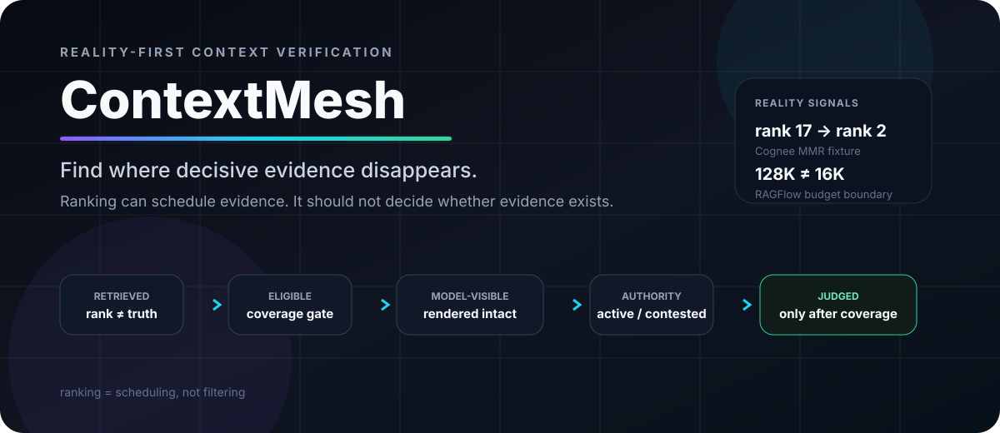
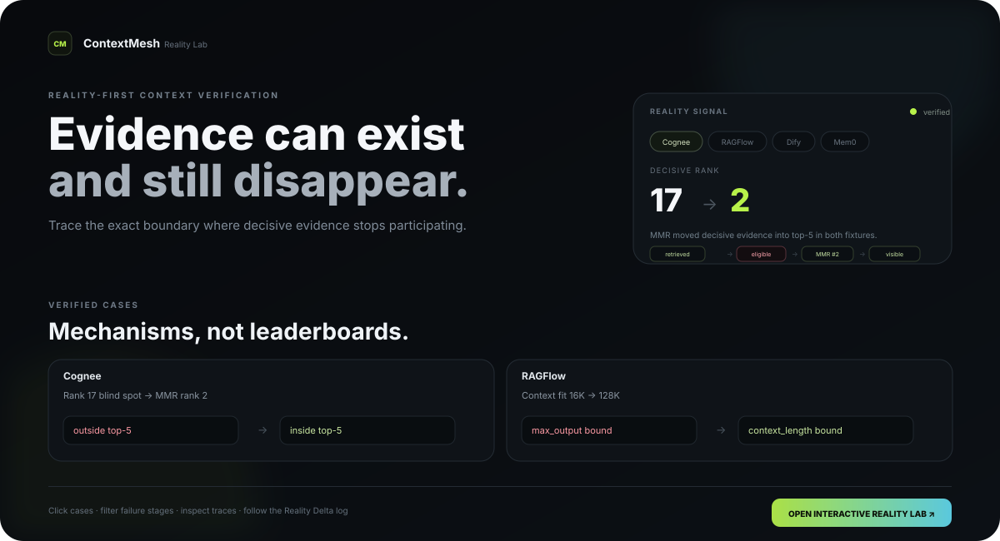
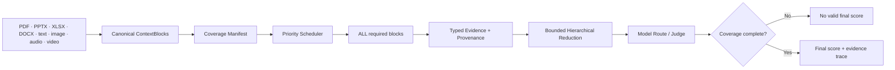

<div align="center">



<br />

# ContextMesh

### Full-coverage context verification for AI systems

**Find where decisive evidence disappears — across retrieval, eligibility, rendering, model visibility, memory authority, and final judgment.**

[Interactive Lab](#interactive-reality-lab) · [Evidence](#reality-not-claims) · [60-second start](#60-second-start) · [Bring a failure](https://github.com/hippoley/ContextMesh/issues/1) · [Contributor board](https://github.com/hippoley/ContextMesh/issues/2)

<br />

[](https://github.com/hippoley/ContextMesh/actions/workflows/ci.yml)
[](pyproject.toml)
[](LICENSE)
[](#reality-not-claims)
[](https://github.com/hippoley/ContextMesh/issues?q=is%3Aopen+label%3A%22good%20first%20issue%22)

</div>

---

> [!IMPORTANT]
> **Decisive evidence should not disappear because it ranked #17.**
>
> ContextMesh is built around a simple boundary: **ranking may decide what is read first; it should not silently decide what is allowed to participate when complete coverage is required.**

A normal retrieval pipeline can look healthy while the decisive page, exception, memory state, or instruction never reaches the final judge. ContextMesh makes that failure inspectable.

```text
ingested
  -> stored
  -> retrieved
  -> eligible
  -> rendered
  -> model-visible
  -> authority
  -> judged
```

The project is **not another RAG framework**. It is a context-verification runtime and Reality Lab for asking a harder question:

> **Did every required piece of evidence actually participate in the decision — and if not, where did it disappear?**

## Interactive Reality Lab

<a href="site/reality.html">
  
</a>

<div align="center">

**Interactive Reality Lab — Pages-ready** · [View source](site/reality.html) · [Bring a failure](https://github.com/hippoley/ContextMesh/issues/1)

</div>

The Reality Lab is the public, interactive surface for the project: switch between verified systems, filter cases by failure stage, open the underlying trace, and follow how a claim changes after an upstream fix or falsification.

> [!NOTE]
> The live URL will be `https://hippoley.github.io/ContextMesh/`. The site is already wired for GitHub Pages and auto-deploys on future `site/**` changes once Pages is enabled for this repository with **Source = GitHub Actions**.


## Reality, not claims

ContextMesh keeps reproducible evidence against current external systems. These are **mechanism tests, not product rankings**.

| System | Measured Reality Delta | What it taught us | Evidence |
| --- | --- | --- | --- |
| **Cognee 1.6.0** | decisive source was **rank 17** in two controlled `CHUNKS` fixtures; visible top-5 omitted it. Replaying Cognee PR #3707's exact MMR selector moved it to **rank 2** in both fixtures | MMR directly fixes these crowding cases. Full coverage and better ranking are complementary, not competing claims | [baseline](docs/reality/Cognee-1.6.0-rank-depth-2026-09-24.md) · [MMR before/after](docs/reality/Cognee-PR3707-MMR-rank17-2026-09-26.md) |
| **RAGFlow current main** | catalog says `context_length=128000`, `max_output=16384`, but chat fitting used the output ceiling as the context budget | a correct constraint can exist in state and still be lost at the execution boundary. A minimal split-budget patch now passes targeted RAGFlow service tests | [before/after](docs/reality/RAGFlow-D24-before-after-2026-09-26.md) · [patch](benchmarks/upstream-patches/ragflow-d24-separate-context-output.patch) |
| **Dify current main** | an 11,343-byte synthetic `SKILL.md` was successfully read, but ordinary shell rendering exposed only head + tail and hid the decisive middle instruction | “source read” is not the same as “semantics model-visible” | [reproduction](docs/reality/Dify-42889-2026-09-24.md) |
| **Mem0 2.2.0** | verified active `5432` and newer contested `6543` were both semantically retrievable with close scores | similarity does not encode epistemic authority; lifecycle policy must remain explicit | [authority replay](docs/reality/Mem0-2.2.0-temporal-authority-2026-09-24.md) |

The important part is that ContextMesh can also **lose an argument**. The Cognee MMR follow-up did exactly that: instead of preserving the original “rank-17 blind spot” as a marketing claim, the Reality Probe showed that the proposed upstream MMR algorithm moved both decisive sources into top-5.

That is the project culture: **reproduce → measure → falsify or fix → publish the boundary.**

## Choose your starting point

| I want to… | Start here |
| --- | --- |
| Reproduce a context blind spot | Run the [Reality Probe](#60-second-start) |
| Evaluate an answer against a corpus larger than one model window | Start the [full-coverage runtime](#run-the-runtime) |
| Understand where evidence disappeared | Read the [evidence lifecycle](docs/EVIDENCE_LIFECYCLE.md) |
| Challenge a ContextMesh claim | [Bring one real failure](https://github.com/hippoley/ContextMesh/issues/1) |
| Contribute without learning the whole codebase | [Adopt a probe/backend](https://github.com/hippoley/ContextMesh/issues/2) |
| See active external demand | Open the [External Demand Radar](docs/reality/EXTERNAL_DEMAND_RADAR.md) |

## 60-second start

Clone the repo and run the deterministic Reality Probe:

```bash
git clone https://github.com/hippoley/ContextMesh.git
cd ContextMesh

python -m venv .venv
source .venv/bin/activate
pip install -e '.[dev]'

contextmesh reality-probe --format markdown
```

The default control compares:

```text
lexical top-k
vs
ContextMesh full-coverage execution
```

The ContextMesh side creates a real manifest and executes the real `ProgressiveEvaluator`. Ranking still controls traversal order; it simply cannot remove a required source from eligibility.

To reproduce the Cognee path with a real Cognee backend:

```bash
pip install -e '.[dev,cognee]'

contextmesh reality-probe \
  --backend cognee \
  --backend contextmesh \
  --top-k 5 \
  --format markdown
```

## One invariant

```text
ranking = scheduling, not filtering
```

This is narrower than “retrieval is bad.”

Retrieval is useful for ordering, latency, exploration, and ordinary question answering. The boundary changes when the task says that **all required evidence must participate before a final score or compliance judgment is valid**.

That gives ContextMesh a different contract:

```text
top-k system:
ranking -> eligibility -> judge

ContextMesh:
coverage manifest -> eligibility
ranking          -> scheduling only
all required evidence -> judge
```

If coverage is incomplete, the system should expose that state instead of silently emitting a fully authoritative score.

## How it works



For corpora larger than the model window, ContextMesh does **not** pretend a model can attend to everything at once.

```text
5M raw tokens
  -> addressable blocks
  -> every required block inspected
  -> source-linked evidence
  -> bounded reduction
  -> final judge
```

Raw blocks remain stored and re-addressable. The final judge receives bounded state only after every required source has participated.

## Evidence is a lifecycle

A healthy retrieval response is not enough. ContextMesh tracks the stages separately:

| Stage | Typical failure |
| --- | --- |
| `ingested` | source never parsed |
| `stored` | payload/provenance lost |
| `retrieved` | relevant source never surfaced |
| `eligible` | rank/cutoff silently removes it |
| `rendered` | truncation or formatting drops the decisive span |
| `model-visible` | tool/shell/transport path hides content |
| `authority` | stale, contested, refuted, or superseded evidence treated as current truth |
| `judged` | reasoning fails even though evidence survived |

This prevents eight different failure modes from collapsing into one vague “the context was missing.”

See [the full evidence lifecycle contract](docs/EVIDENCE_LIFECYCLE.md).

## Run the runtime

For the web/API product with document fallbacks:

```bash
pip install -e '.[dev,rich]'
contextmesh serve --host 127.0.0.1 --port 8765
```

Open:

```text
http://127.0.0.1:8765/        Workspace
http://127.0.0.1:8765/admin   Admin
http://127.0.0.1:8765/docs    API docs
```

Or run the API and worker as separate processes:

```bash
export CONTEXTMESH_EMBEDDED_WORKER=0

contextmesh serve --host 0.0.0.0 --port 8765
contextmesh worker --data .contextmesh
```

A containerized local stack is also available:

```bash
docker compose up --build
```

## One-submit evaluation API

```json
POST /api/evaluation-jobs
{
  "corpus_id": "corp_xxx",
  "question": "Does this answer comply with all uploaded evidence?",
  "answer": "...",
  "route_id": "local-qwen",
  "max_workers": 8,
  "retry_attempts": 2,
  "reduction_batch_size": 32
}
```

The external API accepts one job. Internally the runtime performs as many bounded reads as necessary to satisfy the coverage contract.

## Built for evidence, not just demos

The current runtime includes:

| Layer | Current implementation |
| --- | --- |
| Coverage authority | manifest of required ContextBlocks |
| Payload storage | SQLite/WAL by default; JSON compatibility mode |
| Navigation/search | SQLite + FTS scheduling catalog |
| Execution | resumable checkpoints + deterministic parallel traversal |
| Jobs | durable SQLite/WAL queue with leases, retries, cancellation, worker heartbeats |
| Uploads | resumable local multipart + S3/MinIO multipart |
| Evidence | raw ledger + typed atoms + provenance |
| Reduction | bounded hierarchical reduction |
| Model routing | local/cloud OpenAI-compatible routes and provider-aware route metadata |
| Observability | SSE, failures, token/cost/latency, LMCache/vLLM telemetry |
| Validation | Reality Probes + score-preservation benchmark + fidelity audit |

Search and ranking are acceleration/navigation layers. They do not mutate coverage eligibility.

## ContextMesh is useful when…

| Good fit | Probably use something simpler |
| --- | --- |
| compliance or policy evaluation where one exception can flip the result | ordinary FAQ search |
| benchmark/eval pipelines where omitted evidence invalidates the score | latency-first top-k question answering |
| long documents where decisive evidence may be anywhere | small corpora that fit comfortably in one prompt |
| agent memory where lifecycle/authority matters | simple semantic recall |
| debugging “retrieved but not model-visible” failures | cases where provenance and coverage are irrelevant |
| external correctness probes against upstream systems | product flows that only need a good-enough answer |

ContextMesh is deliberately not claiming that every query needs exhaustive coverage.

## Reality Probe contribution contract

The preferred contribution path is not “invent a feature.” It is:

```text
real upstream failure
    ↓
pin current version / commit
    ↓
minimal reproduction
    ↓
measure the exact failure boundary
    ↓
falsify the claim or build the smallest fix
    ↓
before / after executable evidence
    ↓
take the result back upstream
```

A strong contribution usually contains at least two of:

```text
current-upstream reproduction
measurement that changes understanding of the bug
small adoptable patch / fixture / interface contract
```

The completed [Cognee CHUNKS vs MMR probe](https://github.com/hippoley/ContextMesh/issues/3) is the reference example: the result weakened our original claim and strengthened the upstream MMR proposal.

## Live upstream collaboration

ContextMesh-shaped contracts are currently being tested in real external threads:

- **Graphiti #1880** — ingestion-time verifier boundary, typed verification receipts, single/bulk parity
- **Graphiti #1728** — edge invalidation, cardinality, and explicit retirement reasons
- **Graphiti #1919** — searched-scope receipts for default/all-group retrieval
- **Graphiti #1925** — open memory benchmark protocol and authority lifecycle
- **Dify #42889** — selected/read source with hidden middle semantics
- **Dify #40680** — structured diagnostics for retrieval hits that fail later materialization

The rule is simple: **enter upstream with a reproduction, measurement, regression fixture, or interface contract — not a product pitch.**

See the live [Contributor Board](https://github.com/hippoley/ContextMesh/issues/2).

## First contributions

You do not need to learn the whole architecture.

**Bring evidence:**
[Issue #1 — bring one real context failure](https://github.com/hippoley/ContextMesh/issues/1)

**Own a lane:**
[Issue #2 — adopt a Reality Probe or external backend](https://github.com/hippoley/ContextMesh/issues/2)

**Ready-to-work probes:**

- [#4 — extend Mem0 authority replay with expired, refuted, and superseded states](https://github.com/hippoley/ContextMesh/issues/4)
- [#5 — make the Dify hidden-middle regression fixture standalone](https://github.com/hippoley/ContextMesh/issues/5)
- [#6 — Graphiti ingestion verifier protocol tracker](https://github.com/hippoley/ContextMesh/issues/6)

If you can break a ContextMesh claim, open that result. **Counterexamples are first-class contributions.**

Read [CONTRIBUTING.md](CONTRIBUTING.md) for the full contribution contract.

## Core invariants

```text
ranking = scheduling, not filtering
coverage < 100% => no valid final score
failed block != visited block
raw evidence != reduced model state
parallel completion order != reduction order
retrieved != model-visible
semantic similarity != authority
KV cache != context-window extension
```

## Production boundaries

ContextMesh is currently a serious experimental/runtime project, not a finished multi-tenant SaaS platform.

| Boundary | Current status |
| --- | --- |
| single-host durable queue | implemented with SQLite WAL |
| multi-node queue backend | not yet implemented |
| local + S3/MinIO resumable uploads | implemented |
| auth / RBAC / multitenancy | not yet productionized |
| rich document fallbacks | implemented |
| native provider-specific raw video/audio semantics | still provider-dependent |
| model route context budgeting | enforced in ContextMesh |
| huge-corpus full coverage | externalized traversal + reduction, not native full attention |

No engineering layer can make a model attend to more raw tokens in one forward pass than the model supports.

## Deeper technical docs

- [Full-coverage semantics](docs/FULL_COVERAGE.md)
- [Evidence lifecycle](docs/EVIDENCE_LIFECYCLE.md)
- [Reality Probe methodology](docs/V015_REALITY_PROBE.md)
- [External Demand Radar](docs/reality/EXTERNAL_DEMAND_RADAR.md)
- [Archived v0.15 long-form README](docs/archive/README-v0.15-longform.md)

## License

Apache-2.0. See [LICENSE](LICENSE).

---

<div align="center">

### The next useful contribution is a failure we have not seen yet.

[Bring one](https://github.com/hippoley/ContextMesh/issues/1) · [Adopt a probe](https://github.com/hippoley/ContextMesh/issues/2) · [Read the evidence](docs/reality/EXTERNAL_DEMAND_RADAR.md)

</div>
